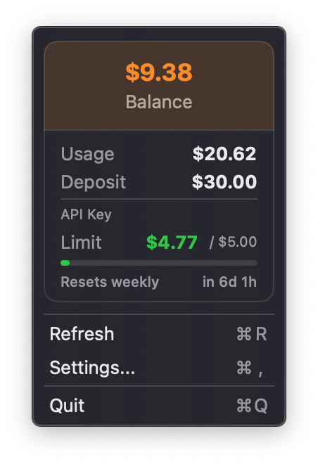

<h1 align="center">
   
  
   
  ORbit
   
</h1>

<h4 align="center">OpenRouter credit balance, always one glance away — right in your macOS menu bar.</h4>

  
  
  

  

 

## What is ORbit?

ORbit is a lightweight macOS menu bar app that shows your [OpenRouter](https://openrouter.ai) credit balance at a glance. No browser tab needed — your balance lives right next to the clock.

- **Instant balance display** — see your credits without opening a browser
- **Auto-refresh** — balance updates every 5 minutes automatically
- **Secure by design** — API key stored exclusively in the macOS Keychain, never in plain text
- **Zero bloat** — no third-party dependencies, pure Swift + SwiftUI
- **Sandboxed** — runs with minimal permissions (outbound network only)

  

---

## Requirements

- macOS 14 Sonoma or later
- An OpenRouter account and API key

---

## Installation

### Download (recommended)

1. [**Download ORbit.dmg**](https://github.com/Joslef/ORbit/releases/latest/download/ORbit.dmg)
2. Open the `.dmg` and drag **ORbit** into your **Applications** folder
3. Launch ORbit from Applications or Spotlight
4. ORbit will appear in your menu bar

> **First launch:** macOS may warn about an unidentified developer. Right-click the app → **Open** → **Open** to proceed.

> **Allow in Security settings:** Go to **System Settings → Privacy & Security** and click **Open Anyway** next to the ORbit entry to allow it to run.

---

## Setup

### Get your OpenRouter API key

1. Go to [openrouter.ai/keys](https://openrouter.ai/keys)
2. Click **Create Key**
3. Copy the key — it starts with `sk-or-...`

### Add your key to ORbit

1. Click the ORbit icon in your menu bar
2. Select **Settings...** (or press `⌘,`)
3. Paste your API key and press **Return** or click **Save Key**
4. Your balance appears instantly in the menu bar

> Your API key is stored securely in the macOS Keychain and never leaves your device unencrypted.

---

## Menu bar display

| Display | Meaning |
|---------|---------|
| `$2.50` | Your current credit balance |
| `ORb: ...` | Loading balance |
| `ORb: ?` | Error fetching balance (check your key) |
| `ORb: --` | No API key configured |

---

## Security

ORbit was designed with security as a priority:

- API key stored in **macOS Keychain** with `WhenUnlockedThisDeviceOnly` — never synced to iCloud
- **Hardened Runtime** enabled — prevents code injection attacks
- **App Sandbox** active — only outbound network access is permitted
- Network requests use an **ephemeral URLSession** — no on-disk response caching
- **No logging** of sensitive data anywhere in the codebase
- Zero third-party dependencies — no supply chain risk

---

## License

MIT — see [LICENSE](LICENSE) for details.
